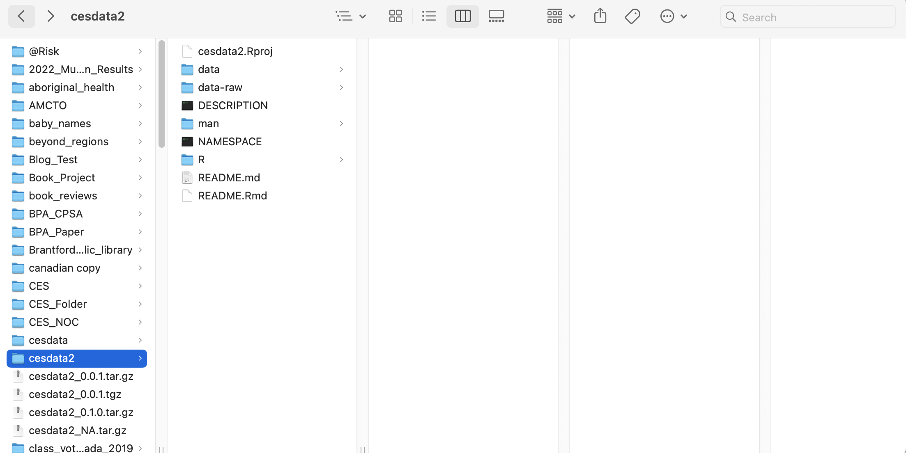

<!-- README.md is generated from README.Rmd. Please edit that file -->

```{r, include = FALSE}
library(knitr)
library(tidyverse)
library(devtools)
library(haven)
library(labelled)
knitr::opts_chunk$set(
  results='markup',
  collapse = TRUE,
  comment = "#>",
  fig.path = "man/figures/README-",
  out.width = "100%",
  warning=F, message=F
)
```

# Introduction

<!-- badges: start -->

<!-- badges: end -->

The goal of this package is to facilitate collaboration and research on the full life cycle of the Canada Election Study.

It solves two problems.

First, it stores all extant CES data files in one spot, quickly loadable in R. Second, it makes available work conducted by Matt Polacko and Simon Kiss to systematically name and recode variables through the lifecycle of the CES. Both are obstacles to research in Canadian politics.

## Installation

You can install the development version of `cesdata2` from [GitHub](https://github.com/) with:

```{r install-cesdata2, eval=F}
# install.packages("devtools")
devtools::install_github("sjkiss/cesdata2")
```

# How to use it.

Once installed and loaded, individual datasets are *immediately* available.

```{r example}
library(cesdata2)
## view sample datasets
library(tidyverse)
#CES21 is immediately available
ces21 %>% 
  select(1:5) %>% 
  glimpse()

#As is CES1965

ces65 %>% 
  select(1:5) %>% 
  glimpse()


```

These are the datasets currently available with the names with which they can be called.

| Dataset title | Filename | Notes |
|:---|---:|:--:|
| CES 1965 | `ces65` |  |
| CES 1968 | `ces68` |  |
| CES 1972 | `ces72_nov` | Only the November, post-election dataset is included |
| CES 1974-1979-1980 | ces7980 | Notes about who is included in the 1980 dataset, how variables were used?? |
| CES 1984 | `ces84` |  |
| CES 1988 | `ces88` |  |
| CES 1993 | `ces93` | Notes about Quebec referendum sample? |
| CES 2000 | `ces00` |  |
| CES 2004-2006-2008-2011 | `ces0411` | this is the combined file for campaign period, post-election and mailback surveys for each of four federal elections. It requires special handling in the construction of a master dataset. See below. |
| CES 2015 Phone | `ces15phone` | Phone survey from 2015 |
| CES 2015 Web | `ces15web` | Web survey from 2015 |
| CES 2019 Phone | `ces19phone` | Phone survey from 2019 |
| CES 2019 Web | `ces19web` | Phone survey from 2019 |
| CES 2021 Web | `ces21` | Werb survey from 2021 |

# Package Structure

It is worth describing the package structure. We have followed advice on creating so-called `data` packages [here](https://r-pkgs.org/data.html) and [here](https://www.davekleinschmidt.com/r-packages/).

Currently the `cesdata2` package comes with two files for each Canada Election Study.

1.  A raw, unedited data file from publicly available libraries of the CES studies, in either SPSS or Stata format. These files are stored in the package's `data-raw` subfolder.

```{r data-raw}
list.files(path="data-raw")
```

2.  An `.rda` file for each that contains the results of our recode scripts. That is to say, it includes recoded variables using our systematic conventions. These are stored in the package's `data` subfolder.

```{r data}
list.files(path="data")
```

The recode scripts themselves are stored in the package subfolder `data-raw/recode_scripts/`. When these scripts are executed via R's `source()` command, they:

1.  Import the Stata or SPSS file from `data-raw`
2.  Execute all documented recode functions
3.  Save an `.rda` object, properly named, in the folder `data`. Doing so, makes the `.rda` file, with all recodes executed, available to users on install and loading.

## Recoding conventions

Polacko and Kiss (particularly the former) have gone to great lengths to recode and rename variables of interest to allow for combination into a single tabular dataset that allows for time series analysis.

Wherever possible, the following conventions have been used.

1.  Likert items have been rescaled from 0 to 1
2.  Liberal views are scored 0 and conservative views are scaled high.MATT IS THIS CORRECT
3.  Directional items are scored low (0) to high (1)

-   Party and leader thermometer ratings are scored (1, strongly dislike, 100 strongly like)
-   Spending preferences are scored such that 0 is less spending 1 is more spending (even though this might conflict with the liberal and conservative ratings in 2. )
-   evaluations of the economy and personal financial situation are scored such that 0 is worse or bad and 1 is better or good.

This is an incomplete list of recoded and renamed variables.

| Concept | Variable Name | notes |
|:---|---:|:--:|
| Demographics |  |  |
| Public Sector Employee | `sector` | Dichotomous variable distinguishes public sector from private sector employees |
| Public Sector Health Welfare and Education | `sector_welfare` | Binary variable distinguishing public sector health, welfare and education employees from all other employees; only available from 2006 on |
| Security | `sector_security` | Binary variable distinguishing security (police, forces, security guards, corrections) from all other employees; only available from 2006 on |
| gender | `male` | Binary variable distinguishing males from others |
| education | `degree` | Binary variable distinguishing BA holders from others |
| Employment Status | `employment` | Binary variable, 1=employed, 2=unemployed |
| Union Status | `union` | Respondent is member of a union;1=R is a member of a union, 0 =not a member of a union; not available for all years |
| Union Status | `union_both` | Binary variable, 1=one member of household is union, 0=neither, available in most datasets |
| Region | `region` | Labelled variable, 1=Atlantic, 2=Ontario, 3=West, northerners excluded |
| Quebec | `quebec` | Labelled variable, 1=Quebec, 0=Not; northerners excluded |
| Income | `income` | Household income, 5 category labelled variable, categories built on pre-existing income categories in provided datasets; 1=Lowest, 2=Lower Middle, 3=Middle, 4=Upper Middle, 5=Upper |
| Income | `income2` | Same as `income` except attempts were made to map boundaries to nearest census quintiles |
| Income | `income_tertile` | Same as `income2` except attempts were made to map boundaries to nearest census tertile |
| Age | `age` | Age in years at time of survey |
| Political |  |  |
| Vote Choice | `vote` | respondent vote choice from PES: groups reform, PCs, CA and Conservatives, includes BQ, Green and Other |
| Vote Choice | `vote3` | respondent vote choice separates out PPC |
| Previous vote | `previous_vote` | respondent previous recalled vote, no split conservatives |
| Previous vote | `previous_vote3` | respondent previous recalled vote, splitting PPC |
| Party ID | `party_id` | CPS Party ID, BQ, Greens, NDP, Liberal Conservative |
| Party ID | `party_id2` | CPS+PES Party ID , BQ, Greens, NDP, Liberal Conservative |
| Ideology |  |  |
| These have no.rmally been coded to run from 0 to 1, liberal to conservative |  |  |
| Gay Rights | `gay_rights` | Gay couples should be allowed to marry, usually from MBS |
| Redistribution | `redistribution` |  |
| Satisfaction with democracy | `satdem` | CPS, Recoded 0 to 1, 1 is satisfied with democracy |
|  | `satdem2` | PES, Recoded 0 to 1, 1 is satisfied with democracy |

# Establishing A Usable Time Series

In the simple case of combining three single-election datasets, we can combine them in this way.

1.  Make a list of your datasets.
2.  Provide names for each list item, corresponding to the election year
3.  Make a separate vector of all the variable names you want to select
4.  Combine `map()` and `select(any_of())` and `list_rbind()`to select those variables and join them together in a tabular data frame.

```{r list-data}
library(tidyverse)
library(haven) 
#make a list of datasets
ces.list<-list(ces00, ces93, ces97)
# Names
names(ces.list)<-c(2000, 1993, 1997)
#Make a vector of desired common variables
myvars<-c("male", "degree", "election")
#Start with ces.list
ces.list %>% 
  #Map onto each data frame in ces.list the function select()
  # select any of the variables in the object myvars
  map(., select, any_of(myvars)) %>% 
  #bind everything into one data frame and save it as ces
  list_rbind(.)->ces
#Glimpse 
glimpse(ces)

  
```

### Issues and Special Cases

#### A variable is not in one of the datasets.

One of the desirable aspects for using the approach of defining common variables and then mapping the `select()` function to each data frame in a list outlined above is that it will still add a CES data frame to the master data frame, even if it does not have the renamed and recoded variable. It will simply populate rows from that data frame with `NA`.

Consider the variable `gay_rights`, it only starts in CES 1993. But it is plausible to imagine a research project where attitudes to gay rights are only one part of the project and one wishes to use data from CES 1988 for other parts.

```{r issue-1}
# Construct the list
ces.list<-list(ces84,ces88, ces93, ces97, ces00)
#names
names(ces.list)<-c(1984,1988, 1993, 1997, 2000)
# Check to see if ces84 gay_rights exists
length(ces84$gay_rights) # Zero indicates it does not exist
#Check to see if ces88 gay_rights exists
length(ces88$gay_rights) #3609 cases of gay_rights values
# Construct common variables
myvars<-c("gender", "vote", "gay_rights", "election")
#Make data frame
ces.list %>% 
  #Select the variables
  map(., select, any_of(myvars)) %>% 
  #bind together providing a new variable Election containing the election year
  list_rbind(.)->ces

```

Now we can confirm what was happen with the variable `gay_rights` in each year.

```{r show-gay-rights-84}
#Check the gay_rights variable in 1984
ces %>% 
  filter(election==1984) %>% 
  select(gay_rights)

```

```{r show-gay-rights-88}
#Check the gay_rights variable in 1988
ces %>% 
  filter(election==1988) %>% 
  select(gay_rights)
```

#### Panel datasets

1.  1974-1979-1980

There is a complete 1974-1979-1980 Canada Election Study file and it is loaded into `cesdata2` as `ces7980`. However, we have also loaded the original 1974 file into `cesdata2` as `ces74`. Effectively we did not make use of the panel feature for 1974-1979. There are respondents in `ces7980` that did participate in the 1974 study. Users can track them down using the variables contained in `ces7980`, but we haven't down that.

The user can search through `ces7980` in this way to filter respondents as they wish in the master file that is necessary to make their CES data-set.

```{r lookfor-74-79-panel}
lookfor(ces7980, "FILTER")

```

It is possible though that the recode script may need to be modified in order to make potential use of this feature. Good luck.

In addition, MATT CAN YOU EXPLAIN WHAT HAPPENED WITH 1980

2.  1992 Referendum and 1993 Election Survey

The object `ces93` contains respondents that participated in both the 1992 Referendum *and* the 1993 general election. All the original distinguishing variables are included in `ces93` for the user to filter and select as necessary.

```{r show-ces93}
ces93 %>% 
  select(contains("RTYPE"), contains("CESTYPE")) %>% 
  as_factor() %>% 
  head()
```

3.  2004-2011

The CES 2004-2011 is a very large file and presents some significant challenges given our renaming and recoding strategy. However, we have come up with a method that is expansive in that recodes are run on every respondent and can then be efficiently filtered to select respondent values for specific sets of surveys.

The underlying data files look like this the following table, for *each* respondent, there are variables for the 2004, 2006, and 2008 surveys *whether or not* the respondent actually completed the surveys.

| Respondent ID | Survey | `ces04_PES_K5A` | `ces06_PES_B4A` | `ces08_PES_B4B` |
|:--:|:--:|:--:|:--:|:--:|
| 1 | 2004 | `Refused` | NA | NA |
| 2 | 2006 | NA | Liberal Party of Canada | NA |
| 3 | 2008 | NA | NA | NDP |
| 4 | 2004 and 2006 | Other | Liberal Party of Canada | NA |
| 5 | 2006 and 2008 | NA |  |  |

Ultimately, each of these columns measure the same variable, the person's vote cast, but at different time periods. As currently constructed, the 2004-2006-2008-2011 will not permit the same name, e.g. `vote` to be used in more than one column.

As a result, we use the following naming conventions in this data-set for variables that have been recoded (e.g. small parties excluded, `Don't Know` responses set to `NA`, `Refused` set to `NA`, etc. )

| Respondent ID | Survey | `ces04_PES_K5A` | `ces06_PES_B4A` | `ces08_PES_B4B` | `vote04` | `vote06` | `vote08` |
|:--:|:--:|:--:|:--:|:--:|:--:|:--:|:--:|
| 1 | 2004 | `Refused` | NA | NA | NA | NA | NA |
| 2 | 2006 | NA | Liberal Party of Canada | NA | NA | Liberal | NA |
| 4 | 2004 and 2006 | Other | Liberal | NA | NA | Liberal | NA |

In order to combine these variables successfully into one tabular dataset, it is first necessary to: 1) split the 2004-2011 dataset into separate datasets for each time election, 2) rename the variables taking out the year indicators, 3) add the split datasets to the list of CES data sets and then recombine.

We could have separated the each election dataset into a separate one in the backend, however, there is a lot of overlap in respondent participation. We did not want to presume how analysts would want to proceed selecting which respondents who took which surveys should be counted in or not. There are advantages and disadvantages to different approaches. So, as a result this step needs to be combined with a step where the researcher specifies which of these surveys you wish to use. Here is the problem....

```{r survey-participation, echo=T}

table(ces0411$survey) 

```

There are multiple ways to split the file. You can split it very precisely and narrowly. For example, one can pick only the respondents who completed the CPS04 survey by using `filter(survey=="CPS04")`.

Or you can select any respondent who filled out the CPS04 survey amongst any other surveys by combining `filter` with `str_detect` and a regular expression.

Compare the two commands, below. Note, to diagnose the accuracy of your regular expression and filter strategy, you can first `select()` only the `survey` variable and count what your filter strategy produces, and then actually filter into a new data frame.

This filter command will *only* include respondents who *only* completed the CPS from 2004.

```{r include-only-cps04, echo=T}
ces0411 %>% 
  select(survey) %>% 
  filter(survey=="CPS04") %>% 
  count(survey) 
```

This filter command will include respondents who *only* completed the CPS from 2004, who only completed the CPS 04 *and* the PES04 as well as the respondents who completed the CPS04, the PES04 and the MBS04.

```{r include-only-cps04-pes04}
ces0411 %>% 
  select(survey) %>% 
  #This filter command will only include respondents
  # with the *exact* values specified
  filter(survey=="CPS04"|survey=="CPS04 PES04"|survey=="CPS04 PES04 MBS04") %>% 
  count(survey) 
```

This command will include *any* respondent who filled out the CPS04. This includes respondents who count as panel respondents who who were reinterviewed in later surveys.

```{r include-any-respondent-completed-CPS04}
ces0411 %>% 
  select(survey) %>% 
  filter(str_detect(survey, "CPS04")) %>% 
  count(survey) 
```

Such a strategy might be desirable to increase sample size, but it might be undesirable to include panel respondents, who, after having been interviewed multiple times, may be demonstrate different responses than other purely cross-sectional respondents. *We leave this to the user.*

When satisfied, it is essential of course to save the results in a single-year dataset.

```{r }
ces0411 %>% 
  filter(survey=="CPS04"|survey=="CPS04 PES04"|survey=="CPS04 PES04 MBS04")->
# Note we are making a new ces04 object that corresponds in naming to all other election year files
ces04

#One can compare the rows
nrow(ces0411)
nrow(ces04)
```

3.  Renaming re-coded variables in `ces04`, `ces06`, `ces08` and `ces11` data frames.

We executed the recode scripts on the merged `ces0411` dataset. This is a giant tabular dataset that includes variables for each election for each respondent, *even if the respondent did not participate in the survey for that variable*. For example, respondents who *only* participated in the CPS04, will still have values for the *all* variables, including variables in the 2006, 2008 and 2011 datasets; their responses will simply be `NA`.

This shows the problem:

```{r show-ces04-vote}
ces0411 %>% 
  filter(str_detect(survey, "PES08")) %>% 
select(survey, contains('vote')) %>% 
  as_factor()

```

The problem is that in other, non-panel datasets, there is no need to indicate the year that it came from.

For example, in the 2000 dataset, `vote` is just that.

```{r show-2000-vote}
ces00 %>% 
  select(election, contains('vote'))
```

It would be impossible to combine say, the 2000, 2004 and 2008 datasets because 2000 contains the variable `vote`, respondents from the 2004 and 2008 datasets would have `vote04`, `vote06`, `vote08` and `vote11`.

The answer is transforming the variable names in data frames into the consistent names used in all the other datasets to facilitate binding together.

Previously, we had a fairly laborious method of individually renaming variables such as `vote04` to be `vote`. There is a cleaner and quicker way to accomplish this. Specifically, for each dataframe that comes from the `ces0411` combined file, we just strip out any instance of `04` in the `ces04` data frame, `06` in the `ces06` dataframe.

You can see the effects of this below:

```{r ces04-select-04-variables}
# make a ces04 data frame
ces0411 %>% 
  filter(str_detect(survey, "PES04"))->ces04
# Make a ces08 data frame
ces0411 %>% 
  filter(str_detect(survey, "PES08"))->ces08
#Take only the ces04 data frame
ces04 %>% 
  #Select variables containing vote and trad
  select(contains('vote'), contains('trad')) %>% 
  #Show the names of the variables
  names()

```

Here it is apparent that there are consistent variables for `04`, `06` and `08` even in the data set that contains only respondents that participated in the `04` survey.

But if we strip out `04` from the variable names we are left with.

```{r strip-out-04}
#Take only the ces04 data frame
ces04 %>% 
  #Select variables containing vote and trad
  select(contains('vote'), contains('trad')) %>% 
  #Show the names of the variables
  names() %>% 
  str_remove_all(., "04")
```

Now, for example, in the `ces04` data frame, `vote04` has become `vote`, `trad041` has become `trad1`, etc. But `vote06`and `trad06` remain untouched.

We make the permanent changes to the data-sets in the following way:

```{r remove-names-04-11}
#Rename variables in 2004
#Strip out any instance of `08` in the names of 08
names(ces04)<-str_remove_all(names(ces04), "04")
#Rename variables in 2008
#Strip out any instance of `08` in the names of 08
names(ces08)<-str_remove_all(names(ces08), "08")

```

And now, we could proceed, as noted above, creating a unified tabular ces dataset from with other, more simple, one-election datafiles.

```{r ces08-select-08-variables}
#List the data frames to be used.
ces.list<-list(ces00, ces04, ces08)

#Provide names
names(ces.list)<-c(2000, 2004, 2008)
myvars<-c("gender", "vote", "gay_rights", "trad1", "election", "mode")

#Make data frame
ces.list %>% 
  #Select the variables
  map(., select, any_of(myvars)) %>% 
  #bind together providing a new variable Election containing the election year
  bind_rows(.)->ces
#Show results
head(as_factor(ces))
#Summarize
summary(as_factor(ces))
```

#### Actual panel analysis

Note, that the ces0411 data file lends itself to amazing panel analysis. However, I have not even begun to think about how the variables would have to be renamed in orer to construct a proper dataset. It is cetainly possible, and probably quite easy, I just haven't done it.

# Future recodes

Users are also welcome to contribute to the package's development by adding new recodes in the recode scripts. The next section shows how to do that.

## Adding recoded variables

1.  Users must clone the package's GitHub repository to their desktop. Instructions on how to do this can be found [here](https://happygitwithr.com/existing-github-first), particularly Section 16.2.2.

Please note, it is essential that users be able to distinguish between the copy of the package that has been *cloned* to your hard drive and the copy of the package that has actually been *installed* for use. They are in two separate locations.

To demonstrate, you can call `.libpaths()` to find out where your package has been installed.

```{r libpaths}
.libPaths()
```

You can open your Finder, or your PC equivalent and actually see it.

```{r path, echo=F, fig.cap="Figure 1: Location of installed version of cesdata2"}
include_graphics("man/figures/path.png")
```

However, the cloned version from GitHub can be stored anywhere you want on your desktop, somewhere useful and easily accessible for the user.

```{r finder-path, echo=F, fig.caption="Figure 2: Location of my cloned copy of cesdata2"}

```

While this may be confusing, it is fairly simple.

```         
1. Using `cesdata2` for analyses draws on the version of the package installed deep in your hard-drive (Figure 1). 

2. Opening `cesdata2` to inspect or modify code is done using the cloned copy stored where you want it to be (Figure 2). 
```

2.  That done, open the RStudio project in the local directory you have just created on your computer which is a clone of the existing package repository.

3.  Open the recode script for the data-set you want to work on. Here, you will need to navigate to the folder `data-raw/recode_scripts/` and select which one you want. In this way you will be able to see, diagnose, modify and execute recode commands in the local environment.

4.  Open the recode script for the file you want to work on, navigate to the bottom, *before* the command `save('filename_.rda')` and add your recodes. You can see the immediate effect of these recodes by running the script from the top to where your cursor is (opt-CMD-B on a Mac) and then check the results.

5.  Once complete and satisfied you should `source()` the recode script from beginning to end. This is important for a few reasons. First, running `source()` is *noticeably* faster than executing code by selecting code in RStudio and running `cmd-Enter`. We have been doing this and it can take forever.

Users will notice that each recode script always starts by loading the *original raw data file* and then saving an `.rda` file out into the folder `data`. *This* is the file that is available to users when they install and load `cesdata2`, *not* the raw data file.

The reason for doing this is to protect the integrity of the original data files by ensuring there is no messy re-writing of original variables and always to be able to track exactly what has been recoded as what.

6.  Because the installed package has pre-built `rda` files for each data-set *it is unnecessary to source anything unless changes have been made*.

However, remember, R uses the version of the package stored in the library, *not* the cloned version you have been working on. After sourcing all scripts where new recodes have been made, installing the new version of the package happens by selecting `Build` and then `Install` in RStudio.

This moves the package contents from location of the cloned directory to the R library deeper in your computer. From here, any analysis script that loads `cesdata2` should make use of your recodes.

7.  To share with other users, which is highly desirable, *re-open the cloned `cesdata2`* project on your computer, make a new Github branch, using an informative title, commit these changes to the GitHub repository and push them to that new branch, *not* the main branch.

The package is currently set up to permit only Simon Kiss and Matt Polacko to contribute to the main branch. All others must commit to other branches. Simon Kiss, package maintainer, will merge branches to the main branch and communicate when that has happened.

# Outstanding Issues

1.  **2015 Web Survey**

The 2015 Web survey is currently included in the package, but there have been almost no variables recoded.

2.  **Value labels**

Right now, all the original CES files are imported via the `haven` package which creates this very awkward `labelled` class variable instead of standard R factors. In hindsight this was a mistake. It would be better to go back and convert those variables as value labels straight to factors.

Care has been taken to ensure value labels are consistent throughout, however, the user is strongly advised to very quickly after making `ces` to use `as_factor()` to convert `labelled` variables to factors.

Care has also been taken to *not* assign value labels to truly numeric or continuous variables. They should show up as class `double`. This does mean that it may be difficult to know exactly what `1` and `0` means in those cases. The user is encouraged to look at the naming conventions in the section above, to quickly crosstab recoded with original variables in the underlying dataframe or to examine the recode scripts in the `cesdata2` package themselves.

## Template For Constructing A CES

We provide here a template R code that will get the user up and running quickly. This can be copied and pasted into an R Script and should work as long as `cesdata2` is installed from the GitHub repository.

Note: this script belongs in an *analysis* project, *not* in the `cesdata2` project.

```{r template, eval=F}
#load libraries
#install if necessary
library(tidyverse)
library(here)
library(labelled)
library(haven)
#Install cesdata2 if you think there may be changes on cesdata2
#devtools::install_github("sjkiss/cesdata2")
library(cesdata2)

#Seprate ces79 and ces80 to two separate files
ces7980 %>% 
  #This variable indicates Rs who completed the 1979 survey, no panel respondents
  filter(V4002==1)->ces79

ces7980 %>% 
  #This variable indicates Rs who completed the 1980 survey, may also havecompleted the 1979 survey; a user should check.
  filter(V4008==1)->ces80
# Drop the `election` variable from ces80
# This is a quirk of the election80 variable; 
# I'll explain another time. Trust me; it is necessary and in this order.
ces80 %>% 
  select(-election)->ces80
#Remove the '80' from the duplicate ces80 variables
# in the ces780
names(ces80)<-str_remove_all(names(ces80), "80")
#Check
#tail(names(ces80))

### Decide On CES 1993 sample
# this command includes only those respondents that completed the 1993 Campaign and Post-Election Survey
# ces93[!is.na(ces93$RTYPE4), ] -> ces93

  #Use Panel Respondents for 2004
ces0411 %>%
 filter(str_detect(ces0411$survey, "PES04"))->ces04

# Use Panel Respondets for 2006
ces0411 %>%
 filter(str_detect(ces0411$survey, "PES06"))->ces06
# Use Panel Respondents for 2008
ces0411 %>% 
  filter(str_detect(ces0411$survey, "PES08"))->ces08

#Use Panel respondents for 2011
ces0411 %>% 
  filter(str_detect(ces0411$survey, "PES11"))->ces11

#Rename variables in 2004
#Strip out any instance of `04` in the names of 04
names(ces04)<-str_remove_all(names(ces04), "04")

#Rename variables in 2006
#Strip out any instance of `06` in the names of 06
names(ces06)<-str_remove_all(names(ces06), "06")
#Rename variables in 2008
#Strip out any instance of `08` in the names of 08
names(ces08)<-str_remove_all(names(ces08), "08")

#Rename variables in 2011
#Strip out any instance of `11` in the names of 11
names(ces11)<-str_remove_all(names(ces11), "11")

# List data frames
ces.list<-list(ces65, ces68, ces72_nov, ces74, ces79, ces80, ces84, ces88, ces93, ces97, ces00, ces04, ces06, ces08, ces11, ces15phone, ces15web, ces19phone, ces19web, ces21, ces25)
#Provide names for list
names(ces.list)<-c(1965, 1968, 1972, 1974, 1979, 1980, 1984, 1988, 1993, 1997, 2000, 2004, 2006, 2008, 2011, "2015 Phone", "2015 Web","2019 Phone", "2019 Web", 2021, 2025)
#Common variables to be selected
#common_vars<-c('male')
common_vars<-c('male',
               'sector', 
               'occupation',
               'employment', 
               'union_both',
               'region', 'union',
               'degree', 
               'quebec', 
               'age', 
               'religion', 
               'vote', 
               'income',
               'redistribution',
               'market_liberalism', 
               'immigration_rates', 
               'traditionalism',
               'traditionalism2', 
               'trad1', 'trad2', 'immigration_rates',
               'market1','market2',
               'turnout', 'mip', 'occupation', 'occupation3', 'education', 'personal_retrospective', 'national_retrospective', 'vote3',
               'efficacy_external', 'efficacy_external2', 'efficacy_internal', 'political_efficacy', 'inequality', 'efficacy_rich', 'promise', 'trust', 'pol_interest', 'foreign',
               'non_charter_language', 'language', 'employment', 'satdem', 'satdem2', 'turnout', 'party_id', 'postgrad', 'income_tertile', 'income2', 'household', 'enviro', 'ideology', 'income_house', 'homeowner','enviro_spend', 'mode', 'election')

ces.list %>% 
  map(., select, any_of(common_vars))%>%
  #bind_rows smushes all the data frames together, and creates a variable called election
  bind_rows()->ces
#show what we have.
glimpse(ces)

#Export to Stata
write_dta(here("ces_master.dta"))
write_csv(here("ces_master.csv"))

```

# Credit

As this R package remains a private, by invitation only repository, there is no way to cite it. Instead, collaborators invited to participate are requested to cite one of the papers in the reference list below as recognition of the work that has gone into this. This package was instrumental in both publications.

# References

Polacko, Matthew, Simon Kiss, and Peter Graefe. “The Changing Nature of Class Voting in Canada, 1965-2019.” Canadian Journal of Political Science/Revue Canadienne de Science Politique 55, no. 3 (September 1, 2022): 1–24.

Kiss, Simon, Peter Graefe, and Matt Polacko. “The Evolving Education-Income Cleavage In Canada.” Electoral Studies, 2023.
